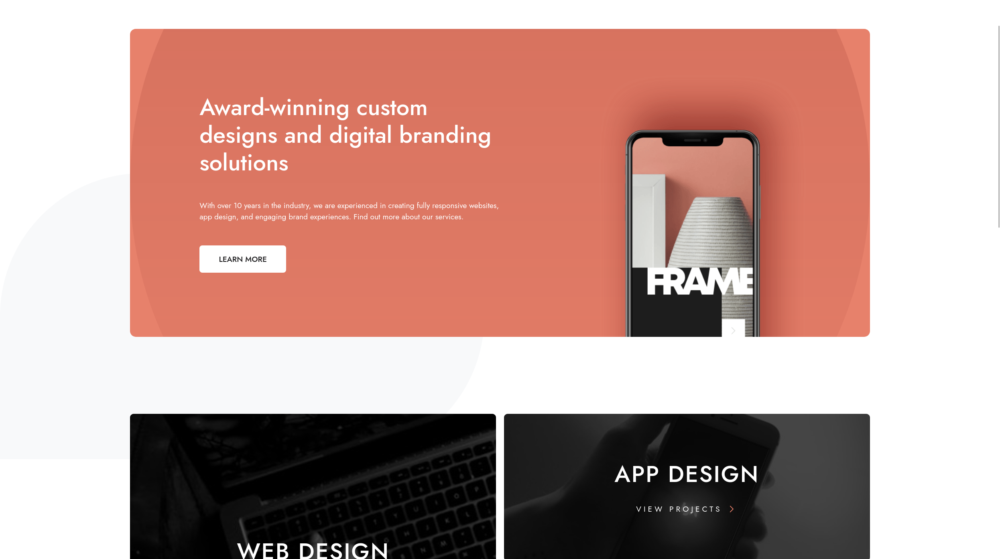

# Frontend Mentor - Designo agency website solution

This is a solution to the [Designo agency website challenge on Frontend Mentor](https://www.frontendmentor.io/challenges/designo-multipage-website-G48K6rfUT). Frontend Mentor challenges help you improve your coding skills by building realistic projects.

## Table of contents

- [Overview](#overview)
  - [The challenge](#the-challenge)
  - [Screenshot](#screenshot)
  - [Links](#links)
- [My process](#my-process)
  - [Built with](#built-with)
  - [What I learned](#what-i-learned)
  - [Continued development](#continued-development)
  - [Useful resources](#useful-resources)
- [Author](#author)

## Overview

### The challenge

Users should be able to:

- View the optimal layout for each page depending on their device's screen size
- See hover states for all interactive elements throughout the site
- Receive an error message when the contact form is submitted if:
  - The `Name`, `Email Address` or `Your Message` fields are empty should show "Can't be empty"
  - The `Email Address` is not formatted correctly should show "Please use a valid email address"

### Screenshot

### Links

- Solution URL: [Link](https://github.com/matijazinic/designo-website)
- Live Site URL: [Link](https://matijazinic.github.io/designo-website/)

## My process

### Built with

- Semantic HTML5 markup
- Mobile-first workflow
- [Astro](https://astro.build/) - All-in-one web framework for building fast websites
- [React](https://reactjs.org/) - JS library
- [TailwindCSS](https://tailwindcss.com/) - For styles

### What I learned

- Basic use of Astro and how it can be used to quickly and easily build fast static websites, while still allowing you to use any of your favorite JavaScript frameworks.
- This was also my first time using TailwindCSS, so I learned some basic usage of that as well. I really like it as it greatly simplifies the part which is most tiresome for many developers, which is writing actual CSS

### Continued development

- Fix all of the background blob images which currently aren't the same as shown on the actual design.
- There was a bonus challenge of allowing users to view actual locations on the locations page maps, which I didn't feel like doing since it's a fake website and I wasn't sure if I could use some random addresses for it. But maybe in the future, this might be done as well.

### Useful resources

- [Example resource 1](https://www.example.com) - This helped me for XYZ reason. I really liked this pattern and will use it going forward.
- [Example resource 2](https://www.example.com) - This is an amazing article which helped me finally understand XYZ. I'd recommend it to anyone still learning this concept.

## Author

- GitHub - [Matija Zinic](https://github.com/matijazinic)
- Frontend Mentor - [@matijazinic](https://www.frontendmentor.io/profile/matijazinic)
